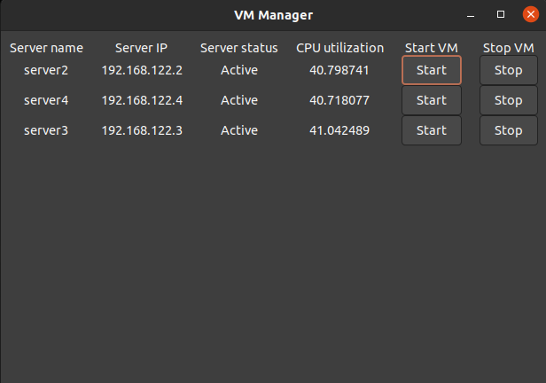

# Assignment 2: Building a VM Manager using libvirt api.

• Cloud Management System (Jan’20-May’20)
◦ Objective: To build a cloud management system using the libvirt API.

◦ Built a system for load balancing and monitoring the CPU utilization of all server VM’s using the libvirt API.
    The VM manager uses libvirt API to create and manage VM's. It has below Dependencies

## Dependencies

- libgtkmm3.0
- libgtk3
- libcairo2
- libcairomm
- libpango
- libpangocairo
- libglibmm-2.4
- libvirt
- gtk+-3.0

◦ Implemented a VM auto-scaling program that detects overload and performs horizontal scaling automatically.
    
    When the load from single/multiple client increases, the VM manager spawns a new VM (horizontal scaling) so that the load is distribued equally among all the available VM's. When the load from client reduces, the VM Manager shut down one of the VM's.

◦ Developed a GUI-based interface to start and stop VM and display real-time metrics such as VM’s CPU utilization. 
    The gui shows the serve name,ip, status and cpu utilization and gives the option to the user to turn on and shut down a particular VM.
    

## Directory Structure

The `gui` directory cntains the source code for the  **vm manager**.

The `client_server` folder contains the source code for **Key Value server**.

The `193059007_demo` folder contains the small demo of **VM manager**

## Compilation Instructions

Makefile is present in gui and client_server folder. Just type **make** command to compile the respective code.

Running the VM manger:
./gui -max_cpu=70 -min_cpu=20 -vm_wait=30 

The parameter are optional
